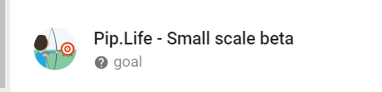
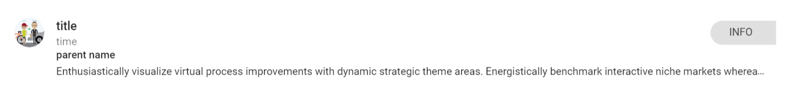
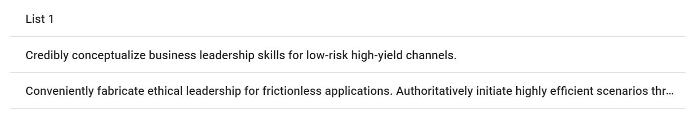
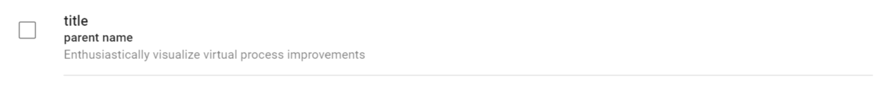
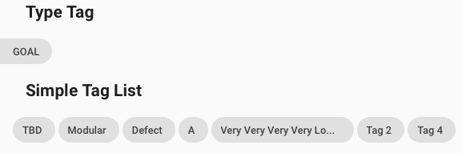
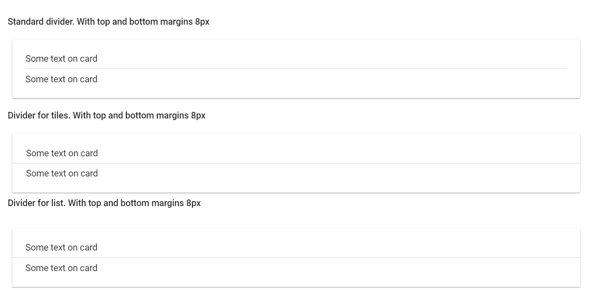

# Pip.WebUI.Lists User's Guide

## <a name="contents"></a> Contents
- [Installing](#install)
- [pip-ref-item component](#ref_item)
- [pip-ref-list component](#ref_list)
- [pip-simple-list component](#simple_list)
- [pip-check-list component](#check_list)
- [pip-table component](#table)
- [pip-chips-\* component](#chips)
- [pip-tag-list directive](#tag_list)
- [pip-divider-\* component](#dividers)
- [Questions and bugs](#issues)


## <a name="install"></a> Installing

Add dependency to **pip-webui** into your **bower.json** or **package.json** file depending what you use.
```javascript
"dependencies": {
  ...
  "pip-webui": "*"
  ...
}
```

Alternatively you can install **pip-webui** manually using **bower**:
```bash
bower install pip-webui
```

or install it using **npm**:
```bash
npm install pip-webui
```

Include **pip-webui** files into your web application.
```html
<link rel="stylesheet" href=".../pip-webui-lib.min.css"/>
<link rel="stylesheet" href=".../pip-webui.min.css"/>
...
<script src=".../pip-webui-lib.min.js"></script>
```

## <a name="ref_item"></a> pip-ref-item component

**pip-ref-item** represents a reference with title, details and avatar.

### Usage
```html
<div class="pip-ref-item">
    
    <div class="pip-content">
        <p class="pip-title">Pip.Life - Small scale beta</p>
        <p class="pip-subtitle">
            <md-icon md-svg-icon="icons:help" class="pip-icon"></md-icon>
            goal
        </p>
    </div>
</div>
```



### CSS Classes
* **pip-pic** - class for pictures
* **pip-content** - class for general div 
* **pip-title** - class for title text
* **pip-subtitle** - class for subtitle text


## <a name="ref_list"></a> pip-ref-list component

**pip-ref-list** is a list filled with **pip-ref-item**s.

### Usage
```html

<md-list class="pip-menu pip-ref-list">

    <md-list-item class="pip-ref-list-item lp16 layout-row layout-align-start-start" md-ink-ripple>

        

        <div class="pip-content">
            <div class="layout-row layout-align-space-between-start">
                <div class="flex">
                    <p class="pip-title">{{item.title}} </p>

                    <span class="pip-subtitle">
                        {{item.time}}
                    </span>
                </div>

                <md-chip class="pip-type-chip pip-type-chip-right md-chip">
                    <div class="pip-text">INFO</div>
                </md-chip>
            </div>

            <p class="pip-text-bold" ng-if="item.parent">{{item.parent}}</p>

            <p class="pip-text" ng-if="item.parent">{{item.text}}</p>

            <p class="pip-text-lg" ng-if="!item.parent">{{item.text}}</p>

        </div>
    </md-list-item>
</md-list>
```



### CSS Classes
* **pip-pic** - class for pictures
* **pip-content** - class for general div 
* **pip-title** - class for title text
* **pip-subtitle** - class for subtitle text
* **pip-text-bold** - class for little bold text 
* **pip-text-lg** - class for max 2 count line 
* **pip-text** - class for normal 16px Roboto text, max 1 line text


## <a name="simple_list"></a> pip-simple-list component

**pip-simple-list** supports hover effects and select marks for the list items.

### Usage
```html
<md-list class="pip-menu pip-simple-list">
    <md-list-item class="pip-simple-list-item pip-selectable" md-ink-ripple ng-repeat="listItem in list">
        <p class="pip-title">{{listItem}}</p>
    </md-list-item>
</md-list>
```



### CSS Classes
* **pip-simple-list-item** - class for simple item
* **pip-title** - class for title

## <a name="check_list"></a> pip-check-list component

**pip-check-list** is a list with clickable items and a checkbox as the primary action

### Usage
```html
<md-list class="pip-menu pip-check-list">

    <md-list-item class="pip-check-list-item" md-ink-ripple ng-click="aaa()" ng-repeat="item in items">
        <div class="pip-item-content layout-row layout-align-start-start">
            <md-checkbox class="pip-checkbox"></md-checkbox>

            <div class="pip-content divider-bottom">
                <p class="pip-title">{{item.title}} </p>
                <p class="pip-text-bold">{{item.parent}}</p>
                <p class="pip-text">{{item.text}}</p>
            </div>
        </div>

    </md-list-item>
</md-list>
```



### CSS Classes
* **pip-checkbox** - class for checkbox
* **pip-content** - class for general div 
* **pip-title** - class for title text
* **pip-text-bold** - class for little bold text 
* **pip-text** - class for normal 16px Roboto text, max 1 line text

## <a name="chips"></a> pip-chip-\* components

**pip-chips**-\* shows a list with read-only chips. It also has special styles for chips that stick to left or right edge.

### Usage
```html
<div>
    <div class="pip-type-chip pip-type-chip-left">
        <span>Type</span>
    </div>
    <div class="pip-chip" ng-repeat="tag in tags">
        <span>{{::tag}}</span>
    </div>
</div>
```



### CSS Classes
* **pip-type-chip** - class for chips of type
* **pip-chip** - general class for chips


## <a name="tag_list"></a> pip-tag-list directive

**pip-tag-list** directive visializes a list of read-only chips (tags)

### Usage
```html
<pip-tag-list pip-tags="tags"
              pip-type="type"
              pip-type-local="typeLocal"
              pip-rebind="true">
</pip-tag-list>
```


See online samples [here...](http://webui.pipdevs.com/pip-webui-controls/index.html#/tags)

### Attributes
* **pip-tags** - array of tags
* **pip-type** - string for type chips
* **pip-type-local** - string to display type chips
* **pip-rebind** - binding pip-tags array. By default equal false


## <a name="dividers"></a> pip-divider-\* components

**pip-divider**-\* used to separate content in different places

### Usage
```html
<md-card>
    <div class="p24-flex">
        Some text on card
        <div class="pip-divider"></div>
        Some text on card
    </div>

</md-card>
```



### CSS Classes
* **pip-dividers** - standard divider with top and bottom margins 8рх
* **pip-tile-divider** - divider for tiles with top and bottom margins 8рх
* **pip-list-divider** -  divider for list with top and bottom margins 8рх


## <a name="issues"></a> Questions and bugs

If you have any questions regarding the module, you can ask them using our 
[discussion forum](https://groups.google.com/forum/#!forum/pip-webui).

Bugs related to this module can be reported using [github issues](https://github.com/pip-webui/pip-webui-csscomponents/issues).
